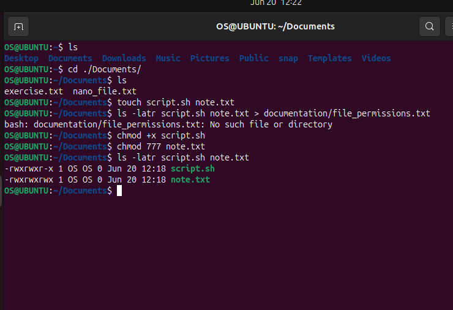
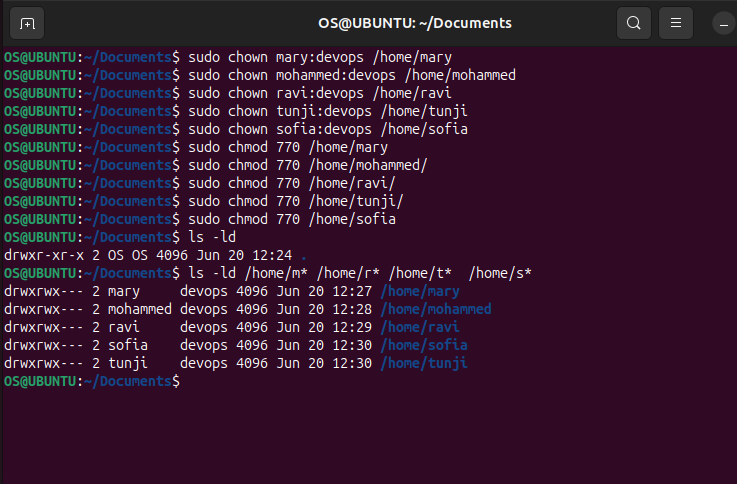

### LINUX COMMAND PROJECT

## All Commands Executed

### 1. Basic Permission Management

# Create test files
- touch script.sh note.txt
- ls -latr script.sh note.txt 

# Change permissions using symbolic method
- chmod +x script.sh
- chmod 777 note.txt

# Verify changes
- ls -latr script.sh note.txt

# Create various permission scenarios
- touch file755.sh file644.txt file600.conf
- chmod 755 file755.sh
- chmod 644 file644.txt
- chmod 600 file600.conf

# Document outputs
- ls -l file* 

##  User and Group Management
* Create Users and Groups

# Create devops group
- sudo groupadd devops

# Create users and add to group
for user in mary mohammed ravi tunji sofia; do
 - sudo adduser $user
 - sudo usermod -aG devops $user
  

# Verify group membership
- id mary 
- id mohammed

Create Home Directories

# Create folders with proper permissions
for user in mary mohammed ravi tunji sofia; do
  - sudo mkdir /home/$user
  - sudo chown $user:devops /home/$user
  - sudo chmod 770 /home/$user
done

# Verify directory permissions
- ls -ld /home/m* /home/r* /home/t* /home/s*

## Superuser Privileges

# Demonstrate sudo usage
- sudo -i
- whoami
- exit

# Test user switching
- su mary
- whoami
- exit

* Password Management

# Change user password
- sudo passwd mary

